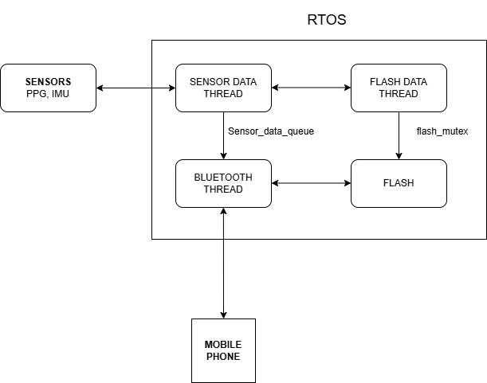

# Firmware Implementation for PPG and IMU Sensors Using FreeRTOS

## Overview
This project implements firmware using FreeRTOS to integrate PPG and IMU sensors. The firmware is designed to periodically sample data, store session-based data in flash storage, and communicate with a mobile phone via BLE.

## System Architecture
The system consists of multiple FreeRTOS threads responsible for handling sensor data acquisition, storage, and BLE communication. Below is the architecture diagram:



## Features
- **Sensor Integration:** Periodic sampling of PPG and IMU sensors
- **Data Storage:** Session-based data saving in flash storage
- **BLE Communication:** Transfer of stored data and session control via Bluetooth
- **Task Management:** Organized FreeRTOS tasks for efficient system operation

## Repository Structure
```
│── README.md               # Project documentation
│── main.c                  # Main firmware file
│── sensor_data.c           # Sensor data acquisition implementation
│── sensor_data.h           # Sensor data acquisition header
│── flash_storage.c         # Flash storage management implementation
│── flash_storage.h         # Flash storage management header
│── ble_comm.c              # BLE communication implementation
│── ble_comm.h              # BLE communication header
```

## Setup Instructions
1. Clone the repository:
   ```sh
   git clone https://github.com/Cruzh3r2107/RTOS_application_for_wearable_device
   ```
2. Build the project using your preferred embedded toolchain.
3. Flash the firmware onto your embedded device.
4. Connect to the device via BLE using a mobile application.

## Future Improvements
- Implement power optimization techniques
- Add error handling and logging mechanisms
- Enhance BLE communication with additional control commands

## Contact
For any queries, feel free to open an issue in this repository or reach out to the contributors.


